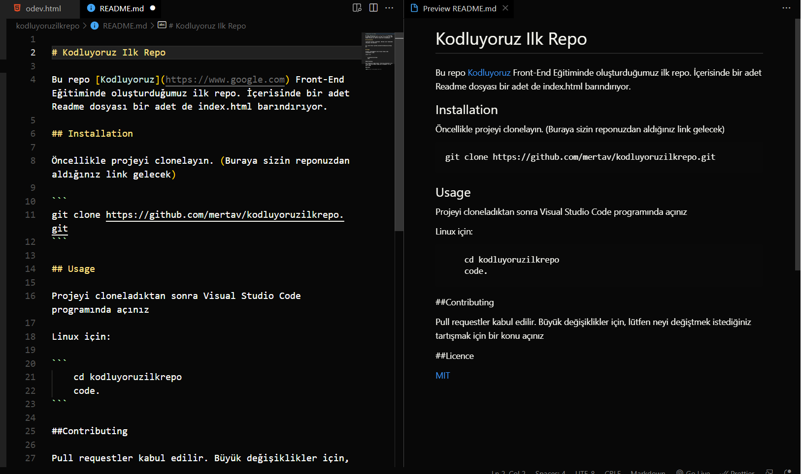

# Kodluyoruz Ilk Repo

Bu repo [Kodluyoruz](https://www.google.com) Front-End Eğitiminde oluşturduğumuz ilk repo. İçerisinde bir adet Readme dosyası bir adet de index.html barındırıyor.


## Installation

Öncellikle projeyi clonelayın. (Buraya sizin reponuzdan aldığınız link gelecek)

```
git clone https://github.com/mertav/kodluyoruzilkrepo.git
```

## Usage

Projeyi cloneladıktan sonra Visual Studio Code programında açınız

Linux için:

```
    cd kodluyoruzilkrepo
    code. 
```

## Contributing

Pull requestler kabul edilir. Büyük değişiklikler için, lütfen neyi değiştmek istediğiniz tartışmak için bir konu açınız

## Licence

[MIT](https//:www.google.com.tr)
